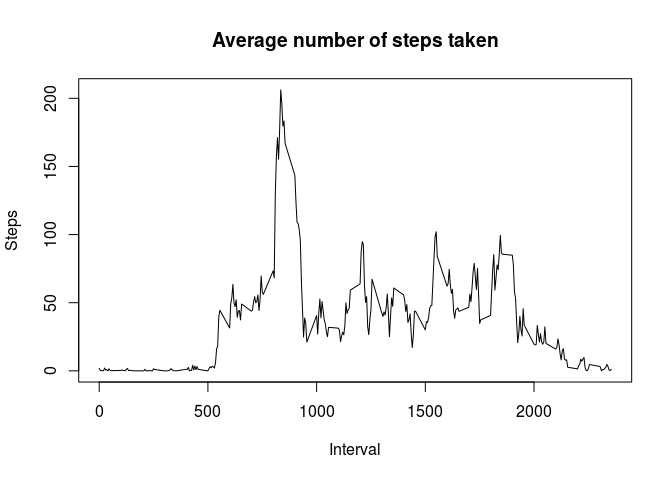

# Reproducible Research: Peer Assessment 1


## Loading and preprocessing the data

```r
data <- data.frame(read.csv("activity.csv"))
```

## What is mean total number of steps taken per day?

```r
total_step_per_day <- setNames(aggregate(data$steps, by=list(Category=data$date), 
                                         FUN=sum),c("date","total"))
hist(total_step_per_day$total, main="Histogram of the total number of steps taken each day",
     ylab ="Frequency", xlab = "Total number of steps taken each day")
```


```r
options(scipen=999, digits =2)
mean <- mean(total_step_per_day$total, na.rm = TRUE)
median <- median(total_step_per_day$total, na.rm = TRUE)
```
The mean total number of steps taken per day is 1.0766189\times 10^{4}.
The median total number of steps taken per day is 10765.

## What is the average daily activity pattern?

```r
average_steps_in_interval <- setNames(aggregate(data$steps, by = list(Category=data$interval), FUN = mean, na.rm=TRUE), c("interval","average_step"))
plot(x=average_steps_in_interval$interval, y=average_steps_in_interval$average_step, type="l", main = "Average number of steps taken", ylab = "Steps",xlab = "Interval")
```



```r
index <- which(average_steps_in_interval$average_step==max(average_steps_in_interval$average_step),arr.ind = TRUE)
options(scipen=999, digits =2)
interval_max <- average_steps_in_interval[index,][1]
average_step_max <- average_steps_in_interval[index,][2]
```
The 5-minute interval, 835, on average contains the maximum number of steps, which equals to 206.1698113.

## Imputing missing values

```r
apply(as.matrix(data$steps), 2, function(z) sum(is.na(z)))
```

```
## [1] 2304
```

```r
apply(as.matrix(data$date), 2, function(z) sum(is.na(z)))
```

```
## [1] 0
```

```r
apply(as.matrix(data$interval), 2, function(z) sum(is.na(z)))
```

```
## [1] 0
```

```r
total_NA <- sum(apply(data, 1, function(z) sum(is.na(z))))

new_data <- data
for(i in 1:dim(new_data)[1]){
  if (is.na(new_data$steps[i])){
    int <- new_data$interval[i]
    new_data$steps[i] <- average_steps_in_interval$average_step[average_steps_in_interval$interval == int]
  }
}

new_total_step_per_day <- setNames(aggregate(new_data$steps, by=list(Category=new_data$date), FUN=sum),c("date","total"))
hist(new_total_step_per_day$total, main="Histogram of the total number of steps taken each day", ylab ="Frequency", xlab = "Total number of steps taken each day")
```


```r
options(scipen=999, digits =2)
new_mean <- mean(new_total_step_per_day$total)
new_median <- median(new_total_step_per_day$total)
```
Only the column *steps* has missing values. The total number of rows with missing values in the dataset is 2304.  
Filling in all of the missing values with the mean for that 5-minute interval. In the new imputed data set, the mean total number of steps taken per day is 10766.19, and the median total number of steps taken per day is 10766.19. The values do not differ from the previous data sets.


## Are there differences in activity patterns between weekdays and weekends?

```r
Date <- as.Date(new_data$date)
Weekday <- weekdays(Date)

new_data$day[Weekday=="Saturday"|Weekday=="Sunday"] <- "weekend"
new_data$day[is.na(new_data$day)] <- "weekday"

average_steps_in_interval_weekend<- setNames(aggregate(new_data$steps[new_data$day=="weekend"], by=list(Category=new_data$interval[new_data$day=="weekend"]), FUN=mean),c("interval","average_weekend"))

average_steps_in_interval_weekday <-setNames(aggregate(new_data$steps[new_data$day=="weekday"], by=list(Category=new_data$interval[new_data$day=="weekday"]), FUN=mean),c("interval","average_weekday"))

par(mfrow=c(2,1))
plot(x=average_steps_in_interval_weekend$interval, y=average_steps_in_interval_weekend$average_weekend ,type = "l",main="weekend", ylab ="", xlab="")
plot(x= average_steps_in_interval_weekday$interval, y=average_steps_in_interval_weekday$average_weekday,type="l",main="weekday", ylab ="",xlab="interval")
```


